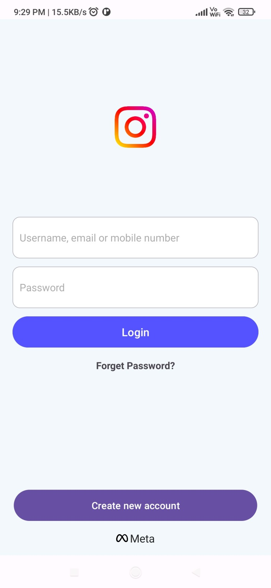
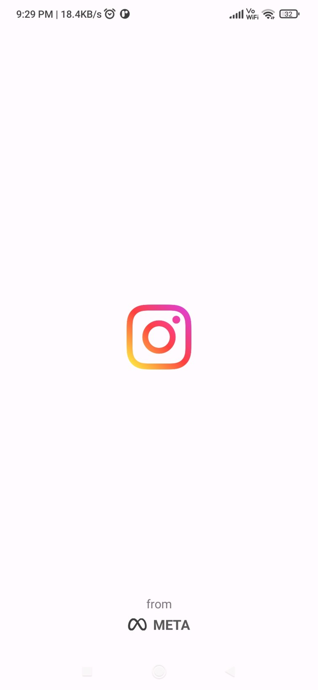
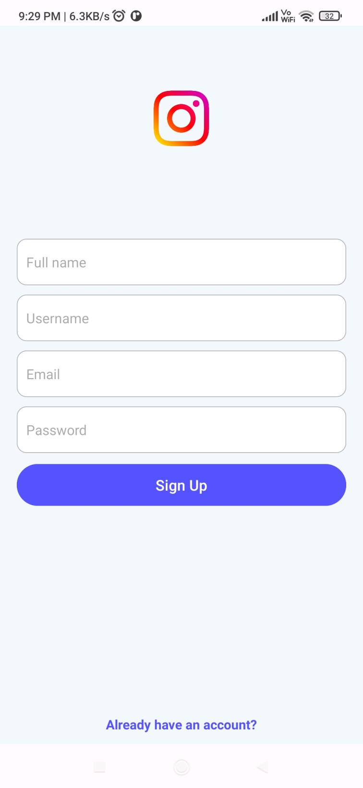

  
  <h1>Instamo</h1>
  
📸 Your Ultimate Visual Storytelling Platform! 🌟

## About

Welcome to Instamo, the perfect destination to capture, share, and inspire through stunning visuals!
📸💖 Whether you're a photography enthusiast, a budding influencer, or simply love connecting with
others, Instamo is your creative hub.

## 📸 Screenshots

  
  
  

### Note :- This app is still in progress

## 🚀 Development Setup

Before you begin, you should have already downloaded the Android Studio SDK and set it up correctly.
You can find a guide on how to do this
here: [Setting up Android Studio](http://developer.android.com/sdk/installing/index.html?pkg=studio).

## 🛠️ Building the Code

1. Clone the repository using HTTP: git clone https://github.com/nayeemdv/Instamo.git

2. Open Android Studio.

3. Click on 'Open an existing Android Studio project.'

4. Browse to the directory where you cloned the **Instamo** repo and click OK.

5. Let Android Studio import the project.

6. Build the application on your device by clicking the run button.

## 💡 Contributing

Whether you have ideas, translations, design changes, code cleaning, or really heavy code changes,
help is always welcome. The more is done, the better it gets! Please respect our Code of Conduct to
keep all interactions and discussions healthy.

  <table><td>
    <a href="#start-of-content">↥ Scroll to top</a>
  </td></table>

